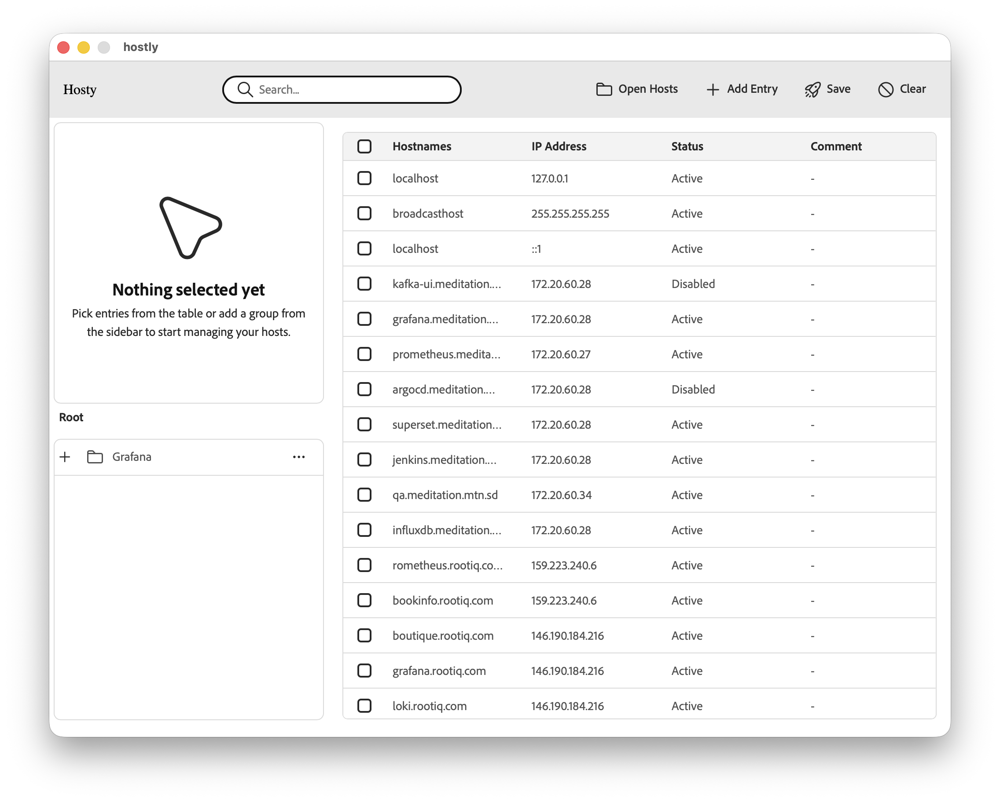
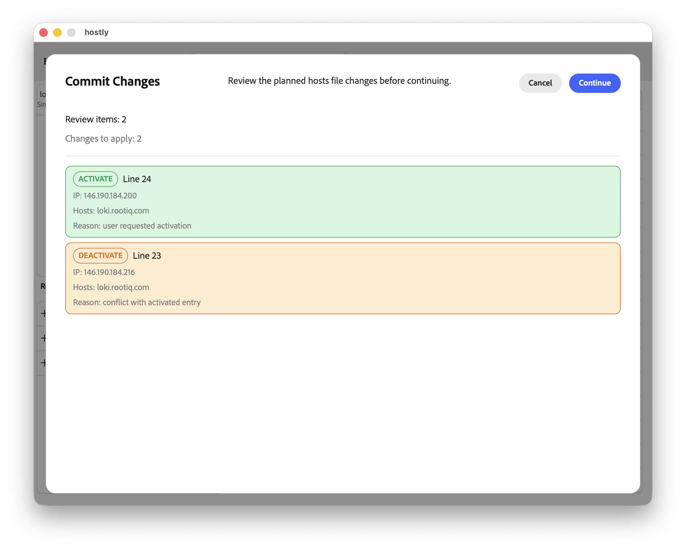

# 🖥️ Hostly - Desktop Hosts File Manager


> 🚧 **Beta Release**
> Hostly is currently in **beta**. Features are functional but may change, and you might encounter bugs or incomplete functionality.
> 👉 **Everyone is welcome to contribute during this stage — feedback, issues, and pull requests are highly appreciated.**


---

Hostly is a cross-platform desktop application built with **Go (Wails)** and **React** that makes managing your system's `hosts` file simple, safe, and efficient.

It is designed for developers, DevOps engineers, and system administrators who frequently modify hosts entries and want to avoid conflicts and manual errors.

---

## ✨ Features

* 🧠 Smart conflict detection
  Automatically detects duplicate host entries with different IPs

* 🔧 Auto-fix conflicts
  Resolve conflicting entries with one click

* ⚡ Fast & lightweight
  Powered by Go backend with a modern React UI

* 🖥️ Cross-platform
  Works on Windows, macOS, and Linux

* 🔍 Clean UI
  Built with React for a smooth user experience

---

## 🧱 Tech Stack

* **Backend:** Go + Wails
* **Frontend:** React
* **Architecture:** Desktop app (no browser needed!)

---

## 📸 Screenshots





---

## ⚙️ Installation

### Option 1: Download Release

1. Go to the **Releases** page
2. Download the binary for your OS
3. Run the application

---

### Option 2: Run from Source

#### Prerequisites

* Go 1.20+
* Node.js (v16+)
* Wails CLI

Install Wails:

```bash
go install github.com/wailsapp/wails/v2/cmd/wails@latest
```

#### Run the App

```bash
git clone https://github.com/your-username/hostly.git
cd hostly
wails dev
```

#### Build

```bash
wails build
```

---

## 🔐 Permissions Note

Modifying the `hosts` file requires **administrator/root privileges**.

Make sure to run the app with elevated permissions:

* Windows → Run as Administrator
* macOS/Linux → Use sudo or grant proper permissions

---

## 🧠 How Conflict Detection Works

Hostly scans your `hosts` file and:

* Groups entries by hostname
* Detects multiple IPs for the same host
* Highlights conflicts in the UI
* Suggests or applies fixes automatically

---

## 📂 Project Structure

```
.
├── frontend/        # React app
├── backend/         # Go logic
├── wails.json       # Wails config
└── main.go
```

---

## 🤝 Contributing

Contributions are welcome!

1. Fork the repo
2. Create a feature branch
3. Commit your changes
4. Open a Pull Request

---

## 🐛 Issues

If you find a bug or have a feature request, please open an issue.

---

## 📜 License

MIT License

---

## 💡 Future Improvements

* Import/export hosts profiles
* Environment-based switching (dev/staging/prod)
* Backup & restore hosts file
* DNS cache flush button
* Integration with Docker / Kubernetes environments

---

## ⭐ Support

If you like this project, give it a ⭐ on GitHub!
